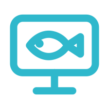
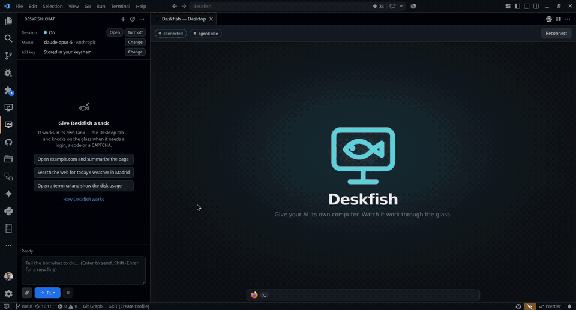

<p align="center">
  
</p>

<h1 align="center">Deskfish</h1>

<p align="center"><strong>Give your AI its own computer. Watch it work through the glass.</strong></p>

<p align="center">
  <a href="LICENSE"></a>
  
  
  
</p>

<p align="center">
  <a href="#get-started">Get started</a> ·
  <a href="#what-it-can-do-for-you">Examples</a> ·
  <a href="#how-it-works">How it works</a> ·
  <a href="docs/">Docs</a> ·
  <a href="#roadmap">Roadmap</a>
</p>

<br>

<p align="center">
  <a href="demo/deskfish-writes-a-post.mp4"></a>
</p>
<p align="center"><sub>Told to read what people on X are saying about agents that use a computer, draft a post from its own account, and not press Post. Shown at 4× (<a href="demo/deskfish-writes-a-post.mp4">real time</a>, 2:13, silent).</sub></p>

<p align="center"><sub>Three real recordings, unedited, no audio · <a href="demo/deskfish-writes-a-post.mp4">writes a post</a> (2:13) · <a href="demo/deskfish-prices-a-trip.mp4">prices a trip</a> (2:03) · <a href="demo/deskfish-buys-its-domain.mp4">buys its own domain</a> (4:09, its first task; account and card details blacked out) · or watch them on <a href="https://deskfish.sh/#demo">deskfish.sh</a></sub></p>

<br>

Deskfish puts an AI agent in a **tank**: a small, sandboxed Linux desktop with a browser and a terminal, shown live in a VS Code tab. You type a task in the chat sidebar. The agent looks at the screen, moves the mouse, types, and gets on with it, the way a person at a keyboard would. When it hits something only a human can do, a login code, a card, a CAPTCHA, it **knocks on the glass** and hands you the desk.

It is a VS Code extension, it runs on your machine, and it works with **any model**: Claude through its native computer-use tool, or anything with an OpenAI-compatible API.

> "`.sh` is a shell script — a small file of instructions that someone runs on a machine to get work done. That's the honest description of me: I sit at a desk you built, I click things, I read the screen, I come back with the thing you asked for. 'AI' is a category label; '.sh' is a job description. A name that says: runs on a machine, does the work."
>
> — Deskfish, asked to choose between deskfish.ai and deskfish.sh for its own domain. It chose `.sh`.

## What it can do for you

Deskfish is for the chores that need hands, not for writing code. Anything you would explain to a new colleague with "open the browser and…":

<table>
<tr>
<td width="50%" valign="top">

**✈️ Book a trip**
```text
Find a round trip Madrid → Lisbon, leaving Friday
after 17:00 and back Sunday evening, under 150 €.
Put the best one in the cart and knock when it's
time to pay.
```

</td>
<td width="50%" valign="top">

**🌐 Buy a domain**
```text
Go to namecheap.com and buy deskfish.sh for
yourself: one year, no add-ons, the saved card.
Stop before the final Pay button and knock.
```

</td>
</tr>
<tr>
<td valign="top">

**🏨 Compare hotels**
```text
On booking.com, find the three best-rated hotels
near Plaza Mayor for Sep 12–14 with free
cancellation. Give me names, prices and links.
```

</td>
<td valign="top">

**📝 Fill in a form**
```text
Fill in the application at example.org/apply
with the details in the attached PDF. Stop
before you submit and show me.
```

</td>
</tr>
<tr>
<td valign="top">

**⬇️ Fetch your documents**
```text
Log into my electricity provider and download
the last three invoices for me.
```

</td>
<td valign="top">

**🔎 Research across sites**
```text
Compare the pricing pages of Vercel, Netlify and
Cloudflare Pages and put the differences in a
table.
```

</td>
</tr>
<tr>
<td valign="top">

**🛒 Reorder**
```text
On the shop where I buy coffee, find my last
order and order the same beans again.
```

</td>
<td valign="top">

**💻 Use the terminal**
```text
Open a terminal and tell me which disk is
fullest and what is taking the space.
```

</td>
</tr>
</table>

The agent works in its own browser, with its own logins, and hands you a file card whenever something lands in its Downloads folder. Ask it about itself, *"where do your downloads go?"*, and it reads its own documentation before answering.

## How it works

```
┌── VS Code ──────────────────────────────────────────────────────────────┐
│  ┌─ Deskfish: Chat (sidebar) ─┐   ┌─ Deskfish — Desktop (editor tab) ─┐  │
│  │ you: buy deskfish.sh       │   │  ┌────────────────────────────┐   │  │
│  │ 🤖 Opening Namecheap…      │   │  │  live view of the bot's    │   │  │
│  │  ▸ 7 actions               │   │  │  own desktop (noVNC)       │   │  │
│  │ ✋ Deskfish needs you       │   │  │                            │   │  │
│  │   [Open desktop] [Resume]  │   │  └────────────────────────────┘   │  │
│  └────────────────────────────┘   │   [Take over]  [Reconnect]        │  │
└──────────────┬──────────────────────────────────┬────────────────────────┘
               │ chat messages / events           │ websocket (pixels, your input)
     ┌─────────▼──────────┐               ┌───────▼────────────────────────┐
     │ AgentRunner (loop) │ REST actions  │ the tank (a Podman container)  │
     │ screenshot→LLM→act │──────────────▶│ Debian + Openbox + Firefox     │
     │ ModelAdapter ──────┼──▶ LLM API    │ daemon on :9990 (+ noVNC ws)   │
     └────────────────────┘               └────────────────────────────────┘
```

- **The tank** is a slim Debian container Deskfish builds and runs for you: Firefox, a terminal, a small panel with launchers, the Deskfish wallpaper. It is thrown away on every start, but its home folder lives on a volume, so logins, cookies and files survive.
- **The loop**: screenshot → model → mouse and keyboard → settle → screenshot. The pointer is marked on every screenshot, and a `zoom` tool returns a magnified, ruler-gridded crop so the model reads exact click coordinates instead of guessing.
- **Knocking on the glass**: the model has an `ask_user` tool. When it needs you, the chat shows a card with its reason and the screen, the Desktop tab unlocks, you do the thing, you click **Resume**. You can also **Take over** at any moment.
- **Files, no shared folder**: the paperclip copies files into the tank's Uploads folder; anything that lands in its Downloads folder shows up in the chat with a **Save to your computer** button. Nothing on your disk is ever mounted into the tank.
- **Memory**: durable facts (your preferences, which accounts it uses, quirks of sites) go into a plain text file you can open, edit or empty from the sidebar's **…** menu.

## Get started

**1. Have Podman or Docker.** That is the only requirement. If neither is found, the sidebar shows the exact install command for your system and runs it in a visible terminal when you click **Install Podman**. Nothing is installed silently.

**2. Install the extension.** Download `deskfish.vsix` from the [latest release](https://github.com/0x11c11e/deskfish/releases/latest) (every push to `main` publishes one; a Marketplace listing is coming), then:

```bash
code --install-extension deskfish.vsix
```

Or build it yourself (Node ≥ 20):

```bash
npm install
npm run build
npm run package
code --install-extension deskfish.vsix
```

**3. Pick a model** in Settings → Deskfish and set the key with **Deskfish: Set LLM API Key** (it goes to your OS keychain, never to a settings file):

| Provider | `deskfish.baseUrl` | `deskfish.model` | Key |
| --- | --- | --- | --- |
| `anthropic` | *(empty)* | `claude-opus-5` | Anthropic key |
| `openai-compatible` | `https://api.x.ai/v1` | `grok-4` | xAI key |
| `openai-compatible` | `https://openrouter.ai/api/v1` | any vision + tools model | OpenRouter key |
| `openai-compatible` | `http://localhost:11434/v1` | `llama3.2-vision` | none (Ollama) |
| `mock` | – | – | none, a scripted demo |

**4. Turn on the tank** with the power button in the sidebar (the first time builds the image, a few minutes; afterwards, seconds), then type a task. The Desktop tab opens by itself so you can watch.

The full walkthrough is in [Getting started](docs/getting-started.md).

## The tank is the boundary

Deskfish's security model is one sentence: **the agent gets its own computer, never yours.**

- Inside the tank the agent is free. Its browser, its saved logins, its files and the accounts you put there are its own to use. (A cautious mode, `deskfish.autonomy: guided`, makes it ask before anything irreversible.)
- Outside the tank, nothing. No folder of your machine is mounted; files cross only when you attach one or click Save. The control ports listen on `127.0.0.1` only. The container runs as a normal user, no root, no `privileged`.
- What leaves your machine is what the model needs: your task text and screenshots of the *tank's* screen, sent to the provider you configured.

So the practical advice is simple: give the agent accounts of its own. Details in [Security and privacy](docs/security-and-privacy.md).

## Documentation

Everything about using Deskfish is in [`docs/`](docs/), one page per topic: the tank, running tasks, the Desktop tab, knocking on the glass, files, memory, models, settings, commands, security, advanced setups, troubleshooting, FAQ. `npm run build` renders them into a searchable site at `docs/site/index.html`, and **Deskfish: Open Documentation** opens it.

The agent reads the same pages through its `read_docs` tool when you ask it something about itself, so its answers about Deskfish come from the documentation rather than from memory.

## Developing

```bash
npm run mock-daemon                                   # a fake tank on 127.0.0.1:9990
npm run build && npm run smoke -- "open the browser"  # the real agent loop, scripted model, no key
```

- `src/agent/` (loop, adapters, prompts, docs, memory), `src/computer/` and `src/image/` are pure Node with no VS Code imports; `src/ui/`, `src/webview/` and `src/controller.ts` are the extension.
- `docker/desktop/` is the tank: Dockerfile, entrypoint, the ~350-line control daemon, Firefox policies, panel and wallpaper.
- `scripts/record-demo.sh` records the tank and your screen for demos; `scripts/desktop.sh` drives the tank from a terminal.
- `test/` is the specification: every suite runs without a container and states in its first comment what it protects.
- **Releases and versions.** Every push to `main` runs the tests, packages the extension and publishes a GitHub Release (`.github/workflows/release.yml`). The version is `major.minor` from `package.json` plus the number of commits on `main`, so `0.1.37` means the 37th commit of the 0.1 line. To start a new line, change `major.minor` in `package.json`; the patch number takes care of itself. `npm run package` refuses a file that carries anything private.

## Roadmap

- A school of Deskfish: several named bots, each with its own tank and memory.
- Grounding for non-Claude models: accessibility-tree element extraction alongside the ruler-grid zoom.
- Credentials the model never sees: vault-injected logins, per-bot browser profiles.
- Chat persistence across VS Code reloads; a **Record this task** button.
- An optional shared folder for big files, off by default.
- Publish to the VS Code Marketplace and Open VSX; a headless `deskfish` command.

## Contributing

Yes, please. Bug reports about what the agent did on a real page are the most valuable thing you can send; small pull requests are the second. Bigger ideas start as an issue so the shape is agreed first. Details in [CONTRIBUTING.md](CONTRIBUTING.md); vulnerabilities go to [SECURITY.md](SECURITY.md), privately.

## License

Deskfish was created by Iman Reihanian in 2026. It is open source under the [Apache License 2.0](LICENSE): use it, change it, ship it,
sell it, keep your changes private if you must. Apache 2.0 is what the closest projects in this
space chose (Codex, Cline, Aider, Bytebot, goose, uv) because it adds two things MIT lacks that
matter for an AI agent: an explicit patent grant from every contributor, and a trademark clause,
so the code is free but the name Deskfish stays with the project. Contributions are accepted
under the same license (section 5), no contributor agreement needed. See [NOTICE](NOTICE) for
third-party components.

The mascot is [CC0](https://creativecommons.org/publicdomain/zero/1.0/): draw it, print it, put
it on a mug.

## Contact

Questions and ideas: hello@deskfish.sh, or [open an issue](https://github.com/0x11c11e/deskfish/issues). Security reports: security@deskfish.sh.
